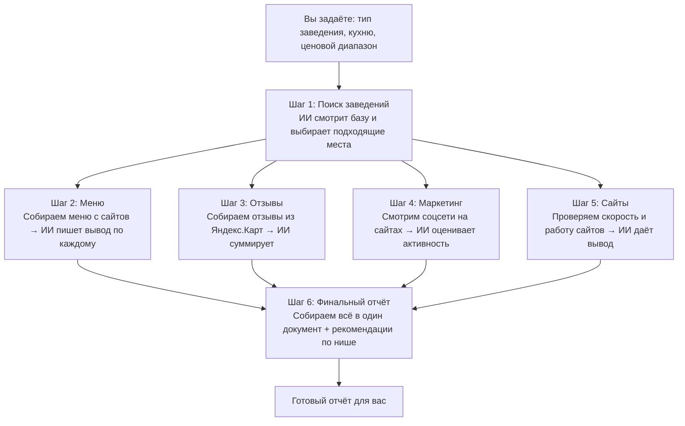
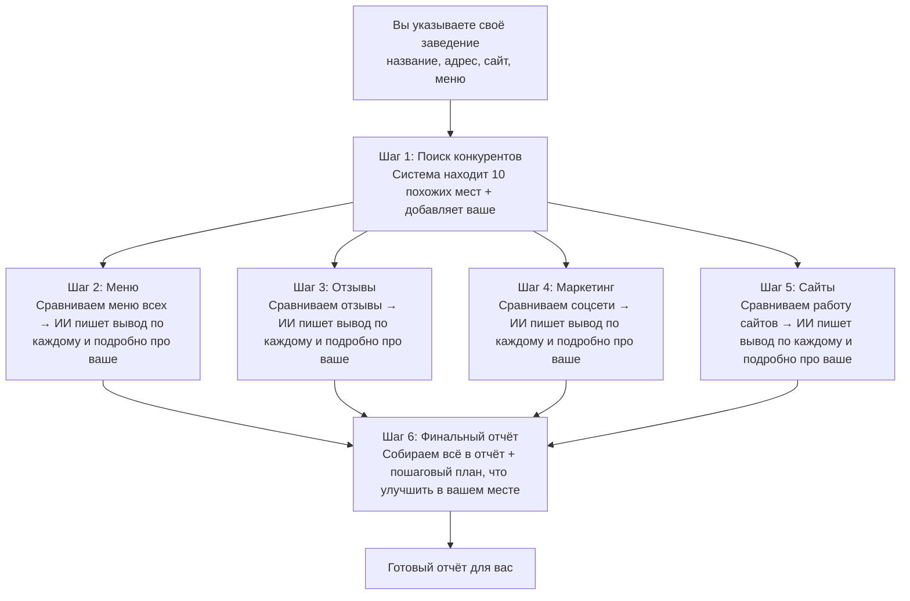

# Как работает анализ ресторанов

---

## Режим 1: Обзор рынка

**Задача:** понять, что происходит в нише в целом (например, «русские рестораны 2000–5000 ₽»). Пользователь задаёт критерии, система находит подходящие заведения и готовит аналитический отчёт по рынку.

### Схема: что и зачем делает каждый шаг

### Простыми словами

| Шаг | Что происходит |
|-----|----------------|
| **1** | Вы говорите, кого ищете (например, «русские рестораны до 5000 ₽»). Система находит такие заведения в базе и описывает выборку. |
| **2** | Для каждого заведения скачиваем меню с сайта. ИИ анализирует ассортимент и цены и пишет короткий вывод. |
| **3** | Собираем отзывы гостей с Яндекс.Карт. ИИ выделяет главное: что хвалят, что ругают. |
| **4** | Заходим на сайты и ищем соцсети (Instagram, Telegram и т.д.). ИИ смотрит, насколько активно они ведутся. Плюс ищем программы лояльности. |
| **5** | Проверяем, как работают сайты: скорость загрузки, есть ли HTTPS. ИИ даёт вывод по каждому. |
| **6** | Всё, что получилось, собираем в один отчёт. Ещё раз вызываем ИИ — он пишет общие рекомендации по нише. |

---

## Режим 2: Конкурентный анализ

**Задача:** сравнить ваше заведение с конкурентами. Вы указываете своё место (название, адрес, сайт, меню), система находит похожих конкурентов и готовит отчёт: где вы сильнее, где слабее и что улучшить.

### Схема: что и зачем делает каждый шаг

### Простыми словами

| Шаг | Что происходит |
|-----|----------------|
| **1** | Вы вводите своё заведение. Система ищет в базе 10 похожих (конкуренты) и добавляет ваше как 11-е. ИИ сразу даёт первый сравнительный вывод. |
| **2** | Сравниваем меню: у кого богаче, у кого дороже. ИИ пишет короткий вывод по каждому и отдельно — развёрнутый по вашему месту. |
| **3** | То же с отзывами: где хвалят, где ругают. ИИ сравнивает всех и подробно разбирает ваше заведение. |
| **4** | Смотрим соцсети: кто как ведёт каналы. ИИ сравнивает и даёт подробный вывод по вашему маркетингу. |
| **5** | Проверяем сайты. ИИ сравнивает и пишет, как ваш сайт выглядит на фоне конкурентов. |
| **6** | Собираем всё в один отчёт. ИИ добавляет пошаговый план: что сделать в первую очередь, чтобы усилить ваше заведение. |

---

## Чем режимы отличаются

| | Обзор рынка | Конкурентный анализ |
|---|-------------|---------------------|
| **Кому** | Кто думает зайти в нишу или изучить рынок | Кто уже ведёт заведение и хочет сравнить себя с конкурентами |
| **На входе** | Критерии поиска (тип, кухня, чек) | Ваше заведение (название, адрес, сайт, меню) |
| **Фокус отчёта** | Общая картина по нише + рекомендации | Сравнение вашего места с конкурентами + план улучшений |
