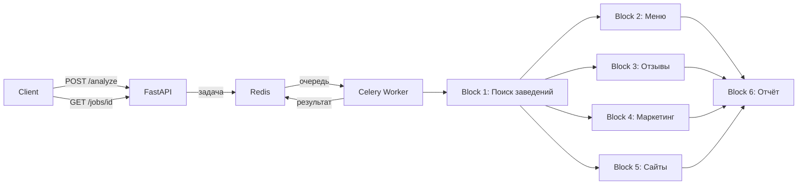

# MarketScope API (v2)

REST API микросервис для анализа ресторанного рынка Москвы. Автоматически собирает данные о заведениях, анализирует меню, отзывы, маркетинг и сайты, генерирует аналитические отчёты с помощью LLM.

## Архитектура

```
POST /analyze → FastAPI → Celery (Redis) → 6-блочный pipeline → GET /jobs/{id}
```



## Стек

| Компонент | Технология |
|-----------|-----------|
| API | FastAPI + Uvicorn |
| Очередь задач | Celery + Redis |
| LLM | Perplexity API (sonar) |
| Векторный поиск | sentence-transformers (rubert) |
| Сентимент-анализ | rubert-tiny2-russian-sentiment |
| Парсинг сайтов | Playwright, undetected-chromedriver |
| Отзывы | Yandex.Maps scraper |
| Контейнеризация | Docker + Docker Compose |

## Быстрый старт

### 1. Клонировать и настроить

```bash
git clone https://github.com/pertila1/marketscope.git
cd marketscope
git checkout ms-v2

cp .env.example .env
# Заполнить ключи в .env
```

### 2. Подложить данные

CSV с базой ресторанов не хранится в git. Положите файл `final_blyat_v3.csv` в корень проекта.

### 3. Запустить

```bash
docker compose up --build -d
```

Поднимутся 3 сервиса:
- **redis** — брокер сообщений
- **api** — REST API на порту 8000
- **worker** — Celery воркер (выполняет pipeline)

### 4. Проверить

```bash
curl http://localhost:8000/health
```

## API

### `POST /analyze` — запустить анализ

**Обзор рынка (template):**
```json
{
  "report_type": "market",
  "mode": "template",
  "top_n": 5,
  "template": {
    "types": ["ресторан"],
    "cuisines": ["грузинская"],
    "price_min": 1000,
    "price_max": 3000
  }
}
```

**Обзор рынка (free_form):**
```json
{
  "report_type": "market",
  "mode": "free_form",
  "top_n": 5,
  "free_form_text": "итальянские рестораны в центре"
}
```

**Конкурентный анализ:**
```json
{
  "report_type": "competitive",
  "mode": "free_form",
  "top_n": 5,
  "free_form_text": "грузинские рестораны",
  "reference_place": {
    "name": "Хачапури и Вино",
    "address": "ул. Большая Дмитровка, 12/1с1",
    "website": "https://hachapuriivino.ru/"
  }
}
```

**Ответ:** `202 Accepted`
```json
{ "job_id": "abc-123-..." }
```

### `GET /jobs/{job_id}` — статус и результат

```json
{
  "job_id": "abc-123-...",
  "status": "done",
  "progress": "6/6",
  "outputs": { "block1": {...}, "block2": {...}, "report_md": "..." }
}
```

Статусы: `pending` → `running` → `done` / `done_partial` / `error`

## Pipeline: 6 блоков

| Блок | Назначение | Источники данных |
|------|-----------|-----------------|
| **1. Relevance** | Поиск и обогащение заведений | CSV + векторный поиск + Perplexity |
| **2. Menu** | Парсинг и анализ меню | Playwright + PDF/image + LLM |
| **3. Reviews** | Отзывы и сентимент | Yandex.Maps + rubert-tiny2 + Perplexity |
| **4. Marketing** | Соцсети и лояльность | Playwright + BeautifulSoup |
| **5. Tech** | Тех. анализ сайта | requests / cloudscraper / chromedriver |
| **6. Aggregator** | Генерация отчёта | Все блоки → Perplexity → Markdown |

Блоки 2-5 выполняются параллельно.

## Переменные окружения

| Переменная | Описание | По умолчанию |
|-----------|----------|-------------|
| `PPLX_API_KEY` | Ключ Perplexity API | обязателен |
| `OPENROUTER_API_KEY` | Ключ OpenRouter (меню) | обязателен |
| `REDIS_URL` | URL Redis | `redis://redis:6379/0` |
| `SOURCE_CSV` | Путь к CSV с ресторанами | `/app/final_blyat_v3.csv` |
| `CELERY_CONCURRENCY` | Число воркеров Celery | `2` |

## Структура проекта

```
├── service/                    # FastAPI + Celery
│   ├── app/
│   │   ├── main.py             # API эндпоинты
│   │   ├── celery_app.py       # Конфиг Celery
│   │   └── tasks.py            # Celery задачи
│   └── worker_start.sh
├── restaurant_pipeline/        # Ядро аналитики
│   ├── orchestrator.py         # Оркестратор блоков
│   ├── blocks/                 # 6 блоков анализа
│   ├── contracts/              # JSON-схемы и примеры
│   └── data_exchange/          # Входные примеры
├── Dockerfile
├── docker-compose.yml
├── requirements.txt
└── .env.example
```
