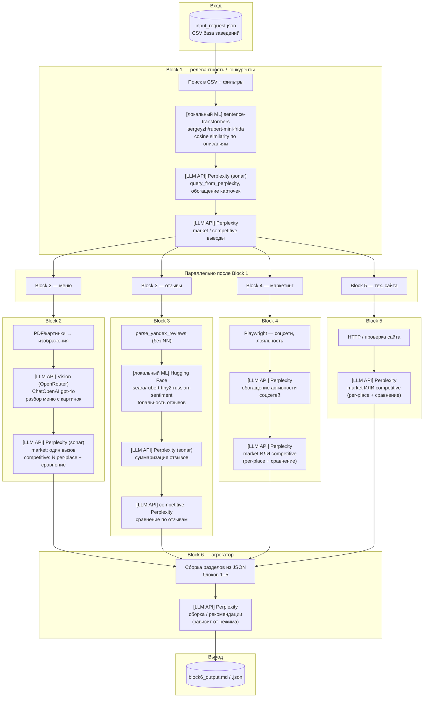

# Схема пайплайна ms_v2 с точками ML / LLM

Кратко: **вход** (`input_request.json` + CSV) → **block1** … **block6** → **отчёт**. Блоки 2–5 после block1 идут **параллельно** (см. `orchestrator.py`).

## Блоки

**1** — выборка из CSV + рыночные выводы · **2** — меню (vision + LLM) · **3** — отзывы: тональность + суммаризация · **4** — соцсети/лояльность + маркетинг · **5** — аудит сайта (скорость, HTTPS, SEO) · **6** — сборка отчёта и финальные рекомендации

## Легенда

| Цвет / тип | Что это |
|------------|---------|
| `[локальный ML]` | Модель крутится у вас (PyTorch / sentence-transformers) |
| `[LLM API]` | Внешний API: Perplexity, OpenRouter |

---

## Диаграмма (уборкой данных + модели)

---

## Сводная таблица моделей

| Участок | Технология | Модель / сервис |
|---------|------------|-----------------|
| Поиск по выборке (block1 / `place_search`) | `sentence-transformers` | `sergeyzh/rubert-mini-frida` |
| Парсинг запроса / обогащение (block1) | Perplexity API | `sonar` (настраивается) |
| Разбор меню по картинкам (block2) | OpenRouter | `openai/gpt-4o` (vision) |
| Аналитика меню (block2) | Perplexity API | `sonar` |
| Тональность отзывов (block3) | `transformers` | `seara/rubert-tiny2-russian-sentiment` |
| Суммаризация и блок. выводы по отзывам (block3) | Perplexity API | `sonar` |
| Активность соцсетей + маркетинг-выводы (block4) | Perplexity API | `sonar` |
| Выводы по тех. сайтам (block5) | Perplexity API | `sonar` |
| Общий competitive/market helper | `competitive_llm` / `market_llm` | Perplexity `sonar` |
| Финальный отчёт (block6) | Perplexity API | `sonar` (по умолчанию) |

**Без ключей API** там, где указан Perplexity, включаются **эвристические fallback** (строки без вызова модели).

---

## Файлы-ориентиры

- Локальный энкодер: `place_search.py`, `encoder_cache/`
- Тональность: `restaurant_pipeline/blocks/block3_reviews/sentiment.py`
- Perplexity обёртки: `competitive_llm.py`, `market_llm.py`, блоки `*_relevance`, `*_menu`, …
- Оркестратор: `restaurant_pipeline/orchestrator.py`
